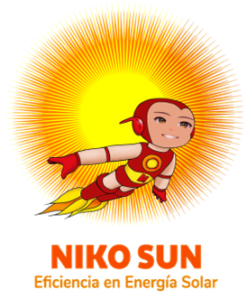

# 🌞 Niko Sun Frontend

<div align="center">



**Decentralized Solar Energy Investment Platform**

[](https://nextjs.org/)
[](https://www.typescriptlang.org/)
[](https://tailwindcss.com/)
[](https://syscoin.org/)

[🌐 Live Demo](https://niko-sun-frontend-fi4c.vercel.app/) | English | [Español](./README.md)

</div>

---

## 📖 Description

**Niko Sun** is a Web3 platform that allows users to invest in solar energy projects by purchasing ERC-1155 tokens. Investors receive proportional dividends based on the energy generated by solar panels.

### How does it work?

1. 🔌 **Connect your wallet** - MetaMask, Coinbase or any compatible wallet
2. 🔍 **Explore projects** - Discover solar projects available for investment
3. 💰 **Buy tokens** - Invest in projects with tSYS (Syscoin testnet)
4. ⚡ **Generate energy** - Your tokens represent participation in solar generation
5. 🎁 **Claim dividends** - Receive rewards proportional to your tokens

---

## 🚀 Quick Start

### Prerequisites

- Node.js 18+
- pnpm (recommended) or npm
- Compatible wallet (MetaMask, Coinbase, etc.)

### Installation

```bash
# Clone the repository
git clone https://github.com/AlesxanDer1102/niko-sun-frontend.git
cd niko-sun-frontend

# Install dependencies
pnpm install

# Run in development
pnpm dev
```

Open [http://localhost:3000](http://localhost:3000) in your browser.

### Configuration

1. **Contract Address** - Update in `types/Abi.ts`:
   ```typescript
   export const SOLAR_TOKEN_ADDRESS = "0x6e9fd4C2D15672594f4Eb4076d67c4D77352A512"
   ```

2. **Network** - Configured for Syscoin Testnet in `rainbowKitConfig.tsx`

---

## 📁 Project Structure

```
niko-sun-frontend/
├── app/
│   ├── page.tsx              # Landing page with projects
│   ├── dashboard/page.tsx    # User portfolio
│   ├── admin/page.tsx        # Administration panel
│   ├── metrics/page.tsx      # Metrics (owner only)
│   ├── globals.css           # Styles and animations
│   ├── layout.tsx            # Layout with sidebar
│   └── provider.tsx          # Web3 Providers
├── components/
│   ├── Header.tsx            # Header with wallet
│   ├── Sidebar.tsx           # Side navigation
│   ├── Footer.tsx            # Footer
│   ├── AdminPanel.tsx        # Administration panel
│   ├── ProjectCard.tsx       # Project card
│   ├── ProjectList.tsx       # Project list
│   ├── ProjectMetrics.tsx    # Global metrics
│   ├── UserBalance.tsx       # User portfolio
│   └── Toast.tsx             # Notification system
├── hooks/
│   └── useSolarContract.ts   # Contract hooks
├── types/
│   └── Abi.ts                # Contract ABI
└── public/
    └── NikoSun_logo.png      # Project logo
```

---

## 🔧 Smart Contract

### SolarTokenV3Optimized

The contract uses the **ERC-1155** standard with **Ownable** pattern for permission management.

#### Roles

| Role | Permissions |
|------|-------------|
| **Owner** | Pause/unpause, create projects for others, view global metrics |
| **Project Creator** | Deposit dividends, update energy, withdraw sales, manage their project |
| **Investor** | Buy tokens, claim dividends, view their portfolio |

#### Main Functions

```solidity
// Any user
createProject(name, totalSupply, priceWei, minPurchase)
mint(projectId, amount) payable
claimRevenue(projectId)
claimMultipleOptimized(projectIds[])

// Project Creator only
depositRevenue(projectId, energyKwhDelta) payable
withdrawSales(projectId, recipient, amount)
setProjectStatus(projectId, active)
updateEnergy(projectId, energyKwhDelta)

// Owner only
pause() / unpause()
createProjectFor(creator, name, totalSupply, priceWei, minPurchase)
```

---

## 🛠️ Technologies

| Technology | Version | Use |
|------------|---------|-----|
| [Next.js](https://nextjs.org/) | 16 | React Framework |
| [TypeScript](https://www.typescriptlang.org/) | 5 | Static typing |
| [Tailwind CSS](https://tailwindcss.com/) | 4 | Styles |
| [wagmi](https://wagmi.sh/) | 2.x | Ethereum Hooks |
| [viem](https://viem.sh/) | 2.x | Ethereum Client |
| [RainbowKit](https://www.rainbowkit.com/) | 2.x | Wallet connection |
| [Lucide React](https://lucide.dev/) | - | Icons |

---

## 📜 Scripts

```bash
pnpm dev          # Development server
pnpm build        # Production build (uses webpack)
pnpm start        # Production server
pnpm lint         # ESLint linter
```

> **Note**: The build uses `--webpack` due to Turbopack incompatibilities with some WalletConnect dependencies.

---

## 🚢 Deployment

### Vercel (Recommended)

1. Push your code to GitHub
2. Import the project in [Vercel](https://vercel.com)
3. Vercel will automatically detect Next.js
4. Deploy!

### Environment Variables (Optional)

```env
NEXT_PUBLIC_WALLETCONNECT_PROJECT_ID=your_project_id
```

---

## 🐛 Troubleshooting

### Error: Modules not found

```bash
rm -rf .next node_modules
pnpm install
pnpm dev
```

### Supported Wallets

- ✅ MetaMask
- ✅ Coinbase Wallet
- ✅ Brave Wallet
- ✅ Trust Wallet
- ✅ Any injected wallet

---

## 🎨 Color Palette

| Color | Hex | Use |
|-------|-----|-----|
| 🟢 Primary | `#10b981` | Renewable energy |
| 🟠 Secondary | `#f97316` | Sun and energy |
| 🟡 Accent | `#fbbf24` | Sunlight |

---

## 📄 License

This project is under the MIT license. See [LICENSE](LICENSE) for more details.

---

<div align="center">

**Built with ❤️ for a sustainable future**

[⬆ Back to top](#-niko-sun-frontend)

</div>
